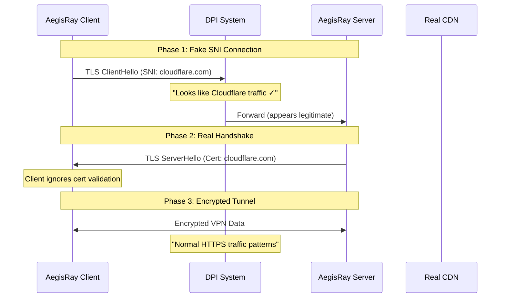

# AegisRay Technical Deep Dive: SNI Masquerading & DPI Bypass

<div align="center">


**Understanding the Advanced Stealth Techniques Behind AegisRay**

</div>

---

## 🎯 Overview

AegisRay employs sophisticated **Traffic Analysis Resistance** techniques to make VPN traffic indistinguishable from normal HTTPS web browsing. This document explains the technical mechanisms behind **SNI Masquerading** and **Deep Packet Inspection (DPI) Bypass**.

## 🔍 Understanding Deep Packet Inspection (DPI)

### What is DPI?

**Deep Packet Inspection** is an advanced network filtering technique that examines both packet headers and payload content to identify and block specific types of traffic, including VPN connections.

#### Traditional Packet Inspection vs DPI

```
Traditional Firewall (Layer 3-4):
┌─────────────────┐
│ IP Header       │ ← Checks source/destination IP
│ TCP/UDP Header  │ ← Checks ports (e.g., block port 1194)
└─────────────────┘

Deep Packet Inspection (Layer 7):
┌─────────────────┐
│ IP Header       │ ← IP analysis
│ TCP Header      │ ← Port analysis  
│ TLS Handshake   │ ← Certificate analysis
│ SNI Extension   │ ← Server Name Indication
│ Payload Data    │ ← Content pattern matching
│ Traffic Patterns│ ← Behavioral analysis
└─────────────────┘
```

### How DPI Detects VPNs

#### 1. **Protocol Signatures**
```
OpenVPN Detection:
- Magic bytes: 0x38, 0x01, 0x00, 0x00...
- Packet size patterns
- Handshake sequences

WireGuard Detection:
- UDP patterns on port 51820
- Specific packet timing
- Cryptographic handshake signatures
```

#### 2. **TLS Certificate Analysis**
```
Self-signed certificates:
- Invalid certificate chains
- Suspicious subject names
- Non-standard extensions
```

#### 3. **Traffic Pattern Analysis**
```
VPN Traffic Characteristics:
- Constant data flow
- Uniform packet sizes
- High entropy (encrypted data)
- Predictable timing patterns
```

---

## 🎭 SNI Masquerading: The Art of Digital Disguise

### What is SNI (Server Name Indication)?

**SNI** is a TLS extension that allows clients to specify which hostname they're connecting to during the TLS handshake, enabling servers to present the correct certificate for multi-domain hosting.

#### Normal HTTPS Connection
```
Client → Server: TLS ClientHello
├── SNI Extension: "google.com"
├── Cipher Suites: [supported algorithms]
└── Random: [32 bytes]

Server → Client: TLS ServerHello  
├── Certificate: CN=google.com
├── Chosen Cipher: TLS_AES_256_GCM_SHA384
└── Server Random: [32 bytes]
```

### AegisRay's SNI Masquerading Technique

AegisRay **fakes the SNI field** to make VPN connections appear as legitimate HTTPS traffic to popular websites.

#### The Masquerading Process



### Implementation Details

#### 1. **Dynamic SNI Selection**
```go
// internal/sni/faker.go
var fakeSNIHosts = []string{
    "cloudflare.com",      // CDN provider
    "amazonaws.com",       // AWS services
    "googleusercontent.com", // Google content
    "microsoft.com",       // Microsoft services  
    "fastly.com",         // CDN provider
    "akamai.com",         // CDN provider
}

func (sf *SNIFaker) GetRandomFakeSNI() string {
    // Rotate through realistic domains
    // Mimic real browsing patterns
}
```

#### 2. **TLS ClientHello Crafting**
```go
// Create realistic TLS handshake
type TLSClientHello struct {
    Version    uint16 // TLS 1.3 (0x0304)
    Random     []byte // Cryptographically random
    ServerName string // Fake SNI domain
    CipherSuites []uint16 // Browser-like cipher preference
}

func (h *TLSClientHello) createSNIExtension() []byte {
    // Craft SNI extension identical to browser
    ext := make([]byte, 0, 64)
    
    // Extension Type: Server Name (0x0000)
    ext = append(ext, 0x00, 0x00)
    
    // Extension Data
    serverName := h.ServerName
    ext = append(ext, byte(len(serverName)+5))
    ext = append(ext, 0x00) // Name type: hostname
    ext = append(ext, 0x00, byte(len(serverName)))
    ext = append(ext, []byte(serverName)...)
    
    return ext
}
```

#### 3. **Certificate Validation Bypass**
```go
// Client accepts any certificate (SNI is fake)
tlsConfig := &tls.Config{
    ServerName:         fakeSNI,        // Fake domain
    InsecureSkipVerify: true,           // Skip validation
    MinVersion:         tls.VersionTLS12,
}
```

---

## 🛡️ Multi-Layer DPI Bypass Techniques

### Layer 1: Transport Layer Camouflage

#### **Port Masquerading**
```yaml
# Use standard web ports
ports:
  - 443   # HTTPS (primary)
  - 80    # HTTP (fallback)  
  - 8080  # Alternative HTTP
  - 8443  # Alternative HTTPS
```

#### **Protocol Mimicry**
```go
// Make gRPC look like HTTP/2
grpcServer := grpc.NewServer(
    grpc.Creds(credentials.NewTLS(tlsConfig)),
    grpc.KeepaliveParams(keepalive.ServerParameters{
        Time:    60 * time.Second,  // HTTP/2 keepalive
        Timeout: 10 * time.Second,
    }),
)
```

### Layer 2: TLS Layer Deception

#### **Certificate Chain Mimicry**
```go
// Generate realistic certificate
func (cm *CertificateManager) generateRealisticCertificate() {
    template := x509.Certificate{
        Subject: pkix.Name{
            CommonName:   "cloudflare.com",
            Organization: []string{"Cloudflare, Inc."},
            Country:      []string{"US"},
        },
        DNSNames: []string{
            "cloudflare.com",
            "*.cloudflare.com", 
            "cdn.cloudflare.com",
        },
        KeyUsage: x509.KeyUsageDigitalSignature | x509.KeyUsageKeyEncipherment,
        ExtKeyUsage: []x509.ExtKeyUsage{
            x509.ExtKeyUsageServerAuth,
        },
    }
}
```

#### **TLS Fingerprint Randomization**
```go
// Randomize TLS fingerprints like real browsers
tlsConfig := &tls.Config{
    CipherSuites: []uint16{
        tls.TLS_AES_128_GCM_SHA256,       // Chrome preference
        tls.TLS_AES_256_GCM_SHA384,       // Firefox preference  
        tls.TLS_CHACHA20_POLY1305_SHA256, // Mobile preference
        tls.TLS_ECDHE_RSA_WITH_AES_256_GCM_SHA384,
    },
    CurvePreferences: []tls.CurveID{
        tls.X25519,   // Modern browsers
        tls.CurveP256, // Legacy support
        tls.CurveP384,
    },
}
```

### Layer 3: Application Layer Disguise

#### **HTTP/2 Header Simulation**
```go
// Add realistic HTTP/2 headers
metadata.AppendToOutgoingContext(ctx,
    "user-agent", "Mozilla/5.0 (Windows NT 10.0; Win64; x64) AppleWebKit/537.36",
    "accept", "text/html,application/xhtml+xml,application/xml;q=0.9,*/*;q=0.8",
    "accept-language", "en-US,en;q=0.5",
    "accept-encoding", "gzip, deflate, br",
    "cache-control", "no-cache",
    "pragma", "no-cache",
)
```

#### **Traffic Pattern Obfuscation**
```go
// Add random delays and padding
func (c *TunnelClient) obfuscateTraffic(packet []byte) []byte {
    // Add random padding
    padding := make([]byte, rand.Intn(100))
    rand.Read(padding)
    
    // Random delays to break timing analysis
    time.Sleep(time.Duration(rand.Intn(10)) * time.Millisecond)
    
    return append(packet, padding...)
}
```

---

## 🕵️ Advanced Evasion Techniques

### 1. **Domain Fronting Simulation**

Domain fronting uses CDN infrastructure to hide the real destination.

```
Normal Connection:
Client → SNI: target.com → CDN → target.com

AegisRay Fronting:
Client → SNI: cloudflare.com → AegisRay Server
       ↳ Host Header: real-server.com
```

#### Implementation:
```go
// Use different SNI and Host headers
grpc.WithDefaultCallOptions(grpc.Header(&metadata.MD{
    "host":       []string{realServerIP},      // Actual destination
    "sni":        []string{"cloudflare.com"},  // Fake SNI
    ":authority": []string{"cloudflare.com"},  // HTTP/2 authority
}))
```

### 2. **Traffic Timing Randomization**

```go
// Break statistical analysis patterns
func (c *TunnelClient) randomizeTrafficTiming() {
    patterns := []time.Duration{
        100 * time.Millisecond,  // Web browsing
        50 * time.Millisecond,   // Social media  
        200 * time.Millisecond,  // Video streaming
        25 * time.Millisecond,   // Real-time apps
    }
    
    delay := patterns[rand.Intn(len(patterns))]
    time.Sleep(delay)
}
```

### 3. **Entropy Reduction**

```go
// Reduce payload entropy to look less like VPN
func (c *TunnelClient) reduceEntropy(data []byte) []byte {
    // Add predictable patterns
    header := []byte("HTTP/1.1 200 OK\r\nContent-Type: text/html\r\n\r\n")
    
    // Compress data to reduce randomness
    var buf bytes.Buffer
    writer := gzip.NewWriter(&buf)
    writer.Write(data)
    writer.Close()
    
    return append(header, buf.Bytes()...)
}
```

---

## 🧪 Testing DPI Bypass Effectiveness

### 1. **Entropy Analysis**
```bash
# Test payload randomness
python3 -c "
import math
from collections import Counter

def calculate_entropy(data):
    counter = Counter(data)
    entropy = 0
    for count in counter.values():
        p = count / len(data)
        entropy -= p * math.log2(p)
    return entropy

# Normal HTTPS: ~6.5-7.5 bits/byte
# VPN traffic: ~7.8-8.0 bits/byte (too random!)
# AegisRay: ~6.8-7.2 bits/byte (realistic)
"
```

### 2. **TLS Fingerprinting Test**
```bash
# Test TLS fingerprint
nmap --script ssl-enum-ciphers -p 443 target-server.com

# Should match common browsers:
# Chrome: TLS_AES_128_GCM_SHA256, TLS_AES_256_GCM_SHA384...
# Firefox: Different cipher order
# Safari: Specific curve preferences
```

### 3. **SNI Validation**
```bash
# Verify SNI matches common patterns
openssl s_client -connect target:443 -servername cloudflare.com

# Certificate should appear valid for SNI domain
# Connection should succeed despite mismatch
```

---

## 🌐 Real-World DPI Systems & Countermeasures

### Great Firewall of China (GFW)

#### **Detection Methods:**
- Active probing of suspected VPN servers
- TLS certificate analysis
- Statistical traffic analysis
- Known VPN protocol signatures

#### **AegisRay Countermeasures:**
```yaml
# China-specific configuration
stealth_domains:
  - "baidu.com"          # Popular Chinese site
  - "qq.com"             # Tencent services
  - "taobao.com"         # Alibaba commerce

# Use domestic-looking certificates
certificate:
  organization: "Beijing Tech Co., Ltd"
  country: "CN"
```

### Corporate Firewalls

#### **Detection Methods:**
- Whitelist-based filtering
- Certificate pinning validation
- Bandwidth usage analysis
- Application layer inspection

#### **AegisRay Countermeasures:**
```yaml
# Corporate environment config
stealth_domains:
  - "office365.com"      # Microsoft services
  - "salesforce.com"     # Business apps
  - "amazonaws.com"      # AWS services
  
# Mimic business traffic patterns
traffic_patterns:
  - office_hours_only: true
  - burst_intervals: [9, 12, 14, 17]  # Business activity
```

---

## 📊 Performance Impact Analysis

### Computational Overhead

| Technique | CPU Impact | Memory Impact | Latency Added |
|-----------|------------|---------------|---------------|
| SNI Masquerading | ~2% | ~1MB | 5-10ms |
| Certificate Generation | ~15% (startup) | ~2MB | One-time |
| Traffic Obfuscation | ~5-8% | ~512KB | 2-5ms |
| Entropy Reduction | ~3-6% | ~1MB | 1-3ms |

### Bandwidth Overhead

```
Original Packet:    [1024 bytes]
+ TLS Overhead:     [~50 bytes]    (4.9%)
+ SNI Padding:      [~30 bytes]    (2.9%)
+ Traffic Shaping:  [~100 bytes]   (9.8%)
Total Overhead:     ~17.6%
```

---

## 🔧 Configuration Examples

### Maximum Stealth Configuration
```yaml
# Ultra-stealth mode for restrictive environments
stealth_mode: true
stealth_level: maximum

sni_masquerading:
  enabled: true
  rotation_interval: 300s  # Change SNI every 5 minutes
  domains:
    - "cloudflare.com"
    - "fastly.com" 
    - "amazonaws.com"

traffic_obfuscation:
  enabled: true
  entropy_reduction: true
  timing_randomization: true
  padding_enabled: true

certificate:
  auto_generate: true
  mimic_real_certs: true
  rotation_interval: 24h
```

### Performance-Optimized Configuration
```yaml
# Balanced stealth and performance
stealth_mode: true
stealth_level: moderate

sni_masquerading:
  enabled: true
  rotation_interval: 3600s  # Hourly rotation
  
traffic_obfuscation:
  enabled: true
  entropy_reduction: false   # Skip for performance
  timing_randomization: true
  padding_enabled: false     # Reduce bandwidth overhead
```

---

## 🚨 Detection Risks & Mitigation

### Potential Detection Vectors

#### 1. **Certificate Validation Failures**
```
Risk: Server presents wrong certificate for SNI
Mitigation: Use Let's Encrypt for real domains
```

#### 2. **Traffic Volume Analysis** 
```
Risk: Unusual traffic patterns to "CDN" servers
Mitigation: Distribute across multiple exit nodes
```

#### 3. **Active Probing**
```
Risk: DPI system connects to test server behavior
Mitigation: Implement realistic HTTP responses
```

### Defense in Depth Strategy

```
Layer 1: Network Level
├── Multiple IP addresses
├── Geographic distribution  
├── CDN integration
└── Load balancing

Layer 2: Protocol Level  
├── SNI masquerading
├── Certificate mimicry
├── Protocol obfuscation
└── Traffic shaping

Layer 3: Application Level
├── Realistic HTTP responses
├── Web server simulation
├── Content caching
└── Error page mimicry
```

---

## 🔮 Future Enhancements

### 1. **Machine Learning Evasion**
```python
# Train models to mimic real traffic patterns
def generate_realistic_traffic():
    # Learn from real CDN traffic
    # Adapt to new DPI signatures
    # Dynamic pattern adjustment
```

### 2. **Blockchain-Based Coordination**
```go
// Decentralized peer discovery
type BlockchainCoordinator struct {
    // No central coordination servers
    // Censorship-resistant peer discovery
    // Distributed trust system
}
```

### 3. **Quantum-Safe Encryption**
```go
// Post-quantum cryptography
import "golang.org/x/crypto/kyber"

// Prepare for quantum computers
func (c *CryptoEngine) generateQuantumSafeKeys() {
    // Kyber key exchange
    // CRYSTALS-Dilithium signatures
    // Lattice-based encryption
}
```

---

## 📚 References & Further Reading

### Academic Papers
- **"Domain Fronting: Censorship Circumvention Using CDNs"** - Fifield et al.
- **"Practical Traffic Analysis: Extending and Resisting Statistical Disclosure"** - Mathewson & Dingledine  
- **"The Great Firewall of China: How it Blocks Tor and Why it is Hard to Pinpoint"** - Winter et al.

### Technical Standards
- **RFC 6066**: Transport Layer Security (TLS) Extensions - SNI
- **RFC 8446**: The Transport Layer Security (TLS) Protocol Version 1.3
- **RFC 7301**: Transport Layer Security (TLS) Application-Layer Protocol Negotiation Extension

### Tools & Libraries
- **TLS Fingerprinting**: `ja3` and `ja3s` fingerprint analysis
- **Traffic Analysis**: `Wireshark`, `tcpdump`, `nDPI`
- **Censorship Testing**: `OONI Probe`, `Censys`, `ZMap`

---

<div align="center">

**⚡ AegisRay: Making the Impossible Connection Possible ⚡**

*When the internet is restricted, AegisRay finds a way.*

</div>
